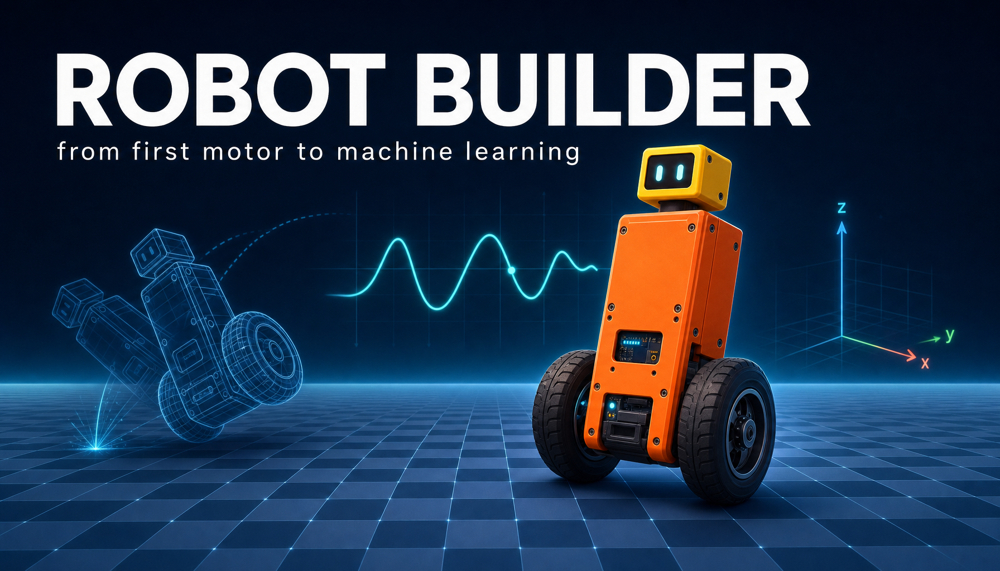
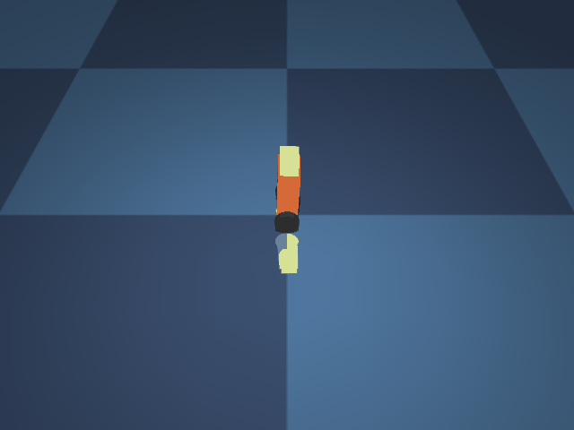
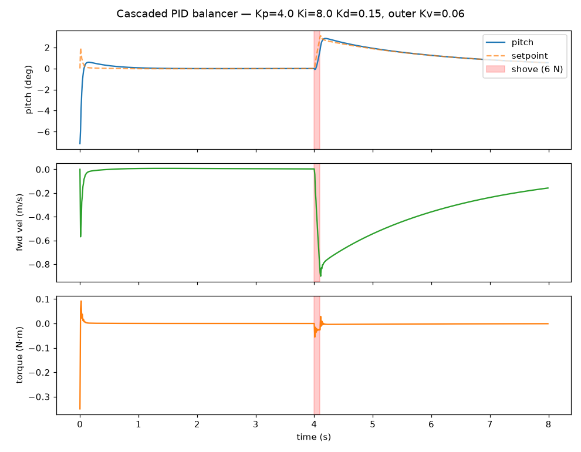
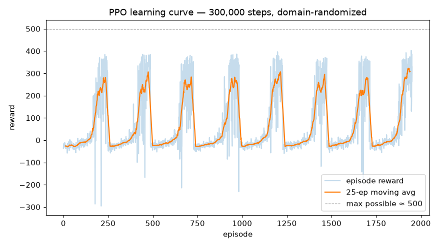

<p align="center">
  
</p>

# Robot Builder — a Claude skill for vibe-coding robots

<p align="center">
  <a href="https://youtu.be/QnRDa8EUHyM">
    
  </a>
  <br/>
  🎬 <a href="https://youtu.be/QnRDa8EUHyM"><b>Watch the intro on YouTube</b></a> — a narrated
  tour: start free in your browser, grow to a full robotics lab, across every kind of robot
  (<a href="media/Robot-Builder-intro-v3.mp4">local copy — v3, 90s</a>).
</p>

**Robot Builder** turns Claude into a robotics mentor and build partner: it walks you from
*"what should I buy for my budget?"* through wiring, SD-card flashing, controllers,
Raspberry Pi and NVIDIA Jetson builds, ROS 2, PID control, simulators and RL training
gyms, internet/cloud security, and putting AI safely on real robots — across **ground,
water, and air** (drones, fixed wing, helicopters, and hobby-legal rockets).

It's one skill with 19 on-demand sub-skill modules, so a single question like *"make my
drone follow me"* can draw on airframes + vision + control + safety at once.

## Beginner → Expert: the ladder (and the cheapest way up each rung)

You need no money, no hardware, and nothing installed to begin. The first three rungs are
free in a browser tab — and designing and simulating *before* you buy is the cheapest way
to be wrong. Climb only as far as your project needs.

| Rung | What you do | Cheapest way to do it | Cost |
|---|---|---|---|
| **1. Explore free** | Learn ROS 2 (the software that runs most robots) and talk to the mentor | Free browser VS Code (GitHub Codespaces / Gitpod); a free Claude, ChatGPT, or Gemini chat, or a no-subscription Poe / Mistral Le Chat bot | **$0** |
| **2. Design** | Draw your robot in 3D before buying a single part | The bundled browser Robot Drafter — nothing to install | **$0** |
| **3. Simulate** | Drive, fly, and safely crash it; train a first vision model | Gazebo / ArduPilot SITL (flight simulator, no aircraft) in that same free Codespace; a free Google Colab GPU to train | **$0** |
| **4. First hardware** | Your first real robot you can drive and then program | A coding-optional kit or RC car (no soldering), then a Raspberry Pi / ESP32 rover with a camera | **< $100 → $300** |
| **5. Autonomy** | Add lidar/depth sensing, ROS 2, mapping and self-navigation | A Pi 5 plus an entry lidar or depth camera | **$300–800** |
| **6. Expert** | Native ROS 2 + CUDA (GPU compute), Isaac Sim, reinforcement learning at scale, Docker-MCP GPU servers, real autonomy | **Rent** an NVIDIA RTX GPU by the hour (~$0.30–2/hr on RunPod / vast.ai / Lambda) instead of buying a $2,000+ card | **rent, or $2,500+** |

Full ladder, an 8-week beginner path, and your first prompts live in the
**[Training Manual](TRAINING_MANUAL.md)**; the free-chatbot hosting options are in
**[setup-and-cloud.md](references/setup-and-cloud.md)**.

## See it work: the virtual self-balancing robot

The repo ships a complete worked example — a two-wheel self-balancing robot **designed,
simulated, and trained entirely by the skill's own playbook**
([examples/self-balancer-sim](examples/self-balancer-sim)): a MuJoCo model of a
hobby-scale balancer (0.7 kg, 40 mm wheels, TT-motor torque limits), wrapped in a
Gymnasium environment, then balanced two ways:

| Classic control: cascaded PID | Machine learning: PPO policy |
|---|---|
|  |  |
| Inner pitch loop + outer velocity loop, tuned the way the skill teaches (Kp → Kd → tiny clamped Ki). Survives a 6 N shove with 2.8° max deviation and settles to 0.5°. | Trained from scratch in ~5 min on a laptop CPU (300k steps, 8 parallel envs) **with domain randomization** — mass ±20% and floor friction varied every episode, the sim2real habit. Holds ~3.5° mean pitch. |
|  |  |

The PID out-balancing the learned policy is the honest lesson, straight from the skill's
AI module: *for problems a deterministic controller solves well, the deterministic
controller wins — AI earns its place where control theory runs out.*

### Run it yourself

```bash
git clone https://github.com/ShaunPrice/robot-builder-skill.git
cd robot-builder-skill/examples/self-balancer-sim
python3.12 -m venv .venv && source .venv/bin/activate
pip install gymnasium stable-baselines3 mujoco matplotlib imageio
python run_pid.py     # cascaded PID + disturbance shove → pid_run.png, pid_balancer.gif
python train_rl.py    # PPO training + eval → learning_curve.png, rl_balancer.gif (~5 min)
```

## Installing the skill

**Claude Code** (CLI, desktop, VS Code) — available in every project:

```bash
git clone https://github.com/ShaunPrice/robot-builder-skill.git ~/.claude/skills/robot-builder
```

Restart Claude Code, then just describe a robot project — the skill triggers itself — or
invoke it explicitly with `/robot-builder`.

**Project-scoped** (share with a team): clone into `.claude/skills/robot-builder/` inside
your project repo.

**Claude.ai**: download **[robot-builder.skill](https://github.com/ShaunPrice/robot-builder-skill/releases/latest)**
from the latest release and upload it under Settings → Capabilities → Skills.

New here? **Start with the [Training Manual](TRAINING_MANUAL.md)** — installation in
detail, your first prompts, an 8-week beginner learning path, and the safety and security
short courses.

### Not using Claude? Builds for other assistants

The knowledge is plain markdown, so it ports. Prebuilt packages for each platform are
attached to the [latest release](https://github.com/ShaunPrice/robot-builder-skill/releases/latest);
adapters and per-platform install guides live in [builds/](builds/):

| Platform | Format | Status |
|---|---|---|
| **Claude** (claude.ai / Claude Code) | native skill (`robot-builder.skill`) | ✅ tested |
| **OpenAI** — [builds/openai](builds/openai/) | Custom GPT instructions + knowledge; `AGENTS.md` for Codex | ✅ Custom GPT tested |
| **Gemini** — [builds/gemini](builds/gemini/) | Gem instructions + knowledge; `GEMINI.md` for Gemini CLI | ✅ Gem tested (10-file knowledge cap — see install guide) |
| **Hermes** (local Docker LLMs) — [builds/hermes](builds/hermes/) | native skill folder (Claude format) or system prompt + knowledge | ✅ tested with local Gemma4-4B |
| **OpenClaw** — [builds/openclaw](builds/openclaw/) | `openclaw skills install` (Claude-compatible folder) | ✅ install/discovery verified |

### Low-cost / free option

No Claude / ChatGPT / Gemini subscription? Host the mentor on **[Poe](https://poe.com)** — free to
build, with real retrieval over the knowledge file and a shareable bot link a learner can just click:

1. Sign up free at [poe.com](https://poe.com) (email / Google / Apple — no card).
2. **Create bot** and pick an economical base model (a mid-tier Claude, GPT, or Gemini) to stretch the free daily points.
3. Paste the persona from [`builds/openai/gpt-instructions.md`](builds/openai/gpt-instructions.md) into the **Prompt** field — if Poe truncates it, keep the core; the detail lives in the knowledge file.
4. Grab the one-file knowledge base `robot-builder-complete.md` (in the Gemini build's `knowledge-gem/`, or run `scripts/make_builds.sh`). Poe rejects `.md`, so copy it first: `cp robot-builder-complete.md robot-builder-complete.txt`
5. Under **Knowledge Base**, upload the `.txt` (optionally enable **Cite sources**).
6. **Create**, ask a beginner question to confirm it quotes the file, then share your `poe.com/YourBot` link.

Free daily points cover light Q&A; heavy use wants Poe's ~$5/mo plan. **Prefer $0 with no metering?**
**[Mistral Le Chat](https://chat.mistral.ai)** is free (no card), uploads `robot-builder-complete.md`
natively as a RAG "Library", and is capped at ~25 messages/day.

## What's inside

| Module | Covers |
|---|---|
| [SKILL.md](SKILL.md) | The mentor playbook: user profiling, the 9-rung build ladder, safety rules, routing |
| [parts-and-budgets.md](references/parts-and-budgets.md) | What to buy at $100 / $300 / $800 / $2,500+, by skill level, with currency guidance |
| [getting-started.md](references/getting-started.md) | SD cards, firmware flashing, RC + gamepad controllers, first-motion checklist |
| [compute-platforms.md](references/compute-platforms.md) | ESP32/Pico → Raspberry Pi → Jetson → flight controllers; the two-brain pattern |
| [sensors.md](references/sensors.md) | Cameras, depth (RealSense/OAK-D), lidar, IMU, GPS/RTK, encoders |
| [ros.md](references/ros.md) | ROS 2 from zero to SLAM + Nav2 |
| [control-and-stability.md](references/control-and-stability.md) | Instrumentation, PID, filters, self-balancers, quadrupeds/bipeds, flight & rocket stability |
| [simulation-and-gyms.md](references/simulation-and-gyms.md) | Gazebo, SITL, MuJoCo, Isaac Lab, Gymnasium RL, sim2real |
| [ground-robots.md](references/ground-robots.md) / [water-robots.md](references/water-robots.md) / [air-robots.md](references/air-robots.md) | Domain builds: rovers, boats/ROVs, multirotors, fixed wing, helis, rockets + regulations |
| [docker-and-environments.md](references/docker-and-environments.md) | Containerized ROS/sim/Jetson stacks; connecting Claude to Docker via MCP |
| [security.md](references/security.md) | Day-one hardening, VPN-only remote access, cloud/MQTT auth, secrets hygiene |
| [ai-ml.md](references/ai-ml.md) | Robot vision, LLM planning, learned control — and the three-loop safety architecture |

## The rules the skill never breaks

- **LiPo discipline, props off on the bench, failsafes before field use.**
- **Aircraft and rockets stay inside the law** (CASA / FAA / EASA, NAR/Tripoli/AMRS) —
  the skill helps you fly legally and will not help otherwise.
- **AI proposes; a deterministic safety layer disposes.** Language models and learned
  policies never get direct actuator authority.
- **Never port-forward a robot to the internet.** VPN or nothing.

## License & status

Personal skill, shared as-is — no warranty; robots can hurt people and property, so
apply your own judgment and local regulations. Issues and ideas welcome.

*Built with Claude (Fable 5) using its own skill-creator + robot-builder skills — the
balancer example was designed, simulated, and trained by the skill following its own
reference modules.*
